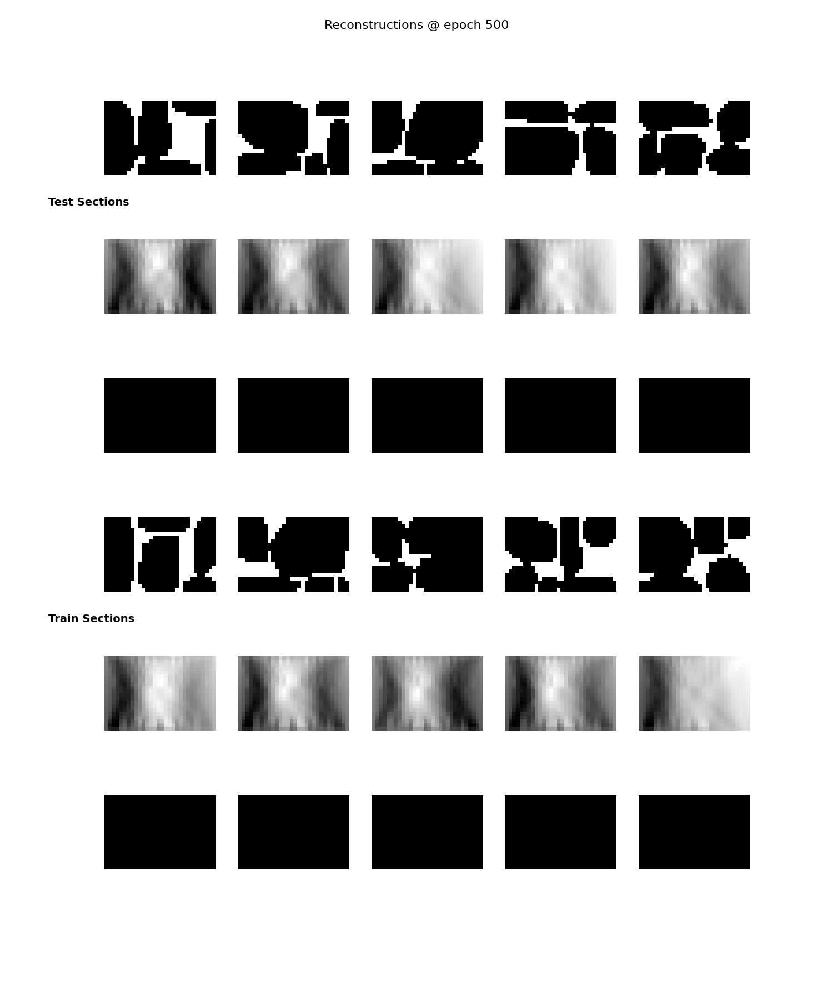
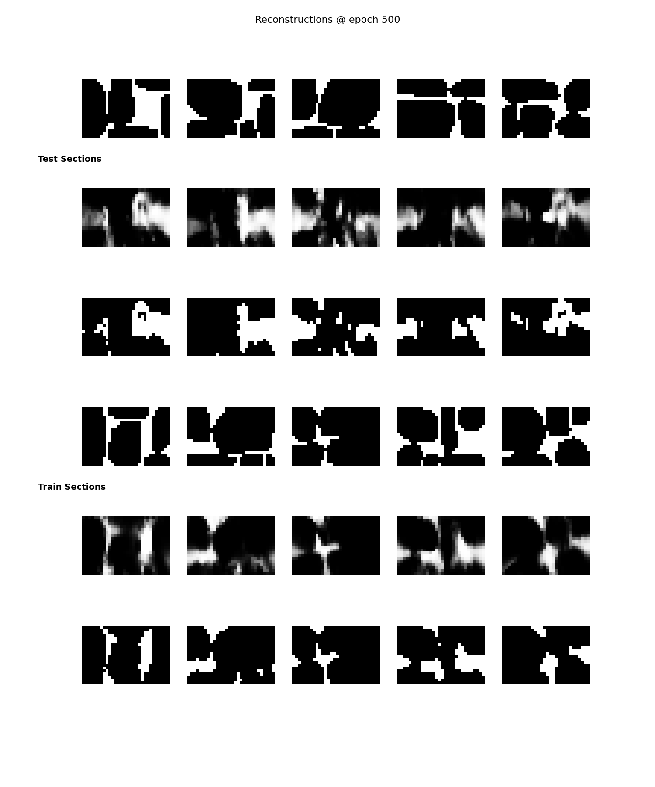

# Neural Network for Cross-Section Prediction

[Back to README.md](../README.md)

This document provides a concise explanation of the main neural network implementation (located in `models/pixel_nn`).

The file `dataset_pixel.py` implements a PyTorch dataset class that with which we wrap the data for the training process to be able to access it. For each pixel, the corresponding data is a vector with the four cordinate bounds of the pixel (X0, Y0, X1, Y1) followed by the following information for each of the rays: emitter and receiver positions (xE, xR, yE, yR), ray distance through pixel, and the autoencoder encoding.

The file `pixel_base.py` implements the base class for autoencoders (including training, logging, evaluating, saving and loading). The exact layer implementation is defined in `architectures/pixel_arch1`. The script to run it is `scripts/train_arch1`, which can be run in the console as in the example (all parameters have reasonable defaults, see file):
```Usage:
    python -m models.autoencoder.scripts.train_arch1 \
        --ae-ckpt "C:\Users\jaime\S-RAY\deep-learning-wall-tomography\artifacts\autoencoder\checkpoints\ConvAENormEnd_resample150_lat32_do10_bn_2025-07-16_11-46-10.pt" \
        --epochs 400  \
        --seed 42
```
It will create log files in `artifacts/pixel_nn` in the root folder. Most importantly, the checkpoints can be found there, with descriptive names. You can view the contents of the checkpoints (including live training visualization) via TensorBoard: 
```
tensorboard --logdir artifacts/pixel_nn --port 6006
```
 You can use the notebook [notebooks/test_arch1.ipynb](../notebooks/test_arch1.ipynb) to generate graphs about a trained model, and you can look at the code to see how you would use a model to make predictions. The graphs are saved in the `results\pixel_nn` folder.


PixelMLP_32bs_1e-05lr_2025-06-25_13-47-09 is a really bad one that only predicted all black (because the autoencoder was missing final batch normalization).


PixelMLP_32bs_1e-04lr_2025-06-26_11-42-31 was much better and reached 92% accuracy for train data, and about 86% accuracy for test data. The train loss descended approximately linearly (and continued to descend) while the training loss started to increase from about the 400th epoch.
