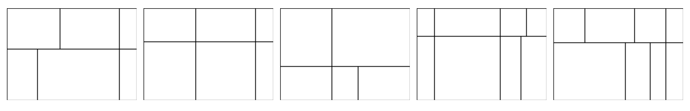
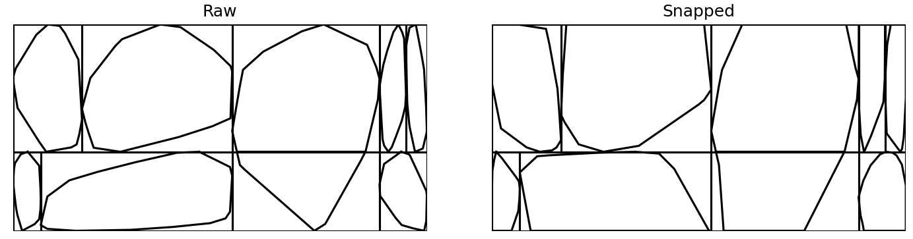

# Sections generator

Under the `sections_generator` we have separate files that help us generate jpg and dxf files of wall cross sections. The jpgs are used for training our model, and the dxf are used for COMSOL generations. 

## Files

### `areas.py`
Has all the code for partitioning a rectangle into chunks to resemble a wall section. The main function defined is `divide_cross_section(...)`. You specify wall width and height, the number of rows, a range of how many divisions are possible per row, the minimum fractions of the wall that each row or column must occupy, and whether to include transversal stones (none, random, random or none, center, left, right). Note that if we try to generate center transversal stones and the maximum number of columns is not at least three it will return error. If the minimum number of columns is less than three but the maximum is valid, it will force at least three columns for center TS. This will return `ValueError` if it struggles to find a valid division after a certain number of attempts. 

There is also a `main()` function so the file can be run to display examples of wall subdivisions for the given parameters. Here is a sample result:

### `stones.py`
Defines the core functions for generating and manipulating random polygonal stones inside rectangular wall cells. The primary function is `random_stone(...)`, which generates a random, non-self-intersecting polygon within a bounding box, ensuring a minimum area coverage (parameter `K`).

You can also "snap" stones to edges or corners (`snap_to_border`, `snap_to_corner`), specifying which corner or border as a parameter. Finally, `clip_polygon_to_rect` is used for transversal stones. If consecutive points after clipping are too close (indicating a degenerate spike that often occurs), it raises a ValueError.

### `section.py`
This file defines the `generate_cross_section(...)` function, which takes in all necessary parameters and calls `divide_cross_section` and generates a stone for each rectangle, snapping to corners and borders as needed. It handles ValueErrors by trying again. It also has a `main()` function that displays sample sections before and snapping. For example:

### `main.py`
When run, this file generates the specified number of jpg and dxf sections and saves them in the ouput folder.