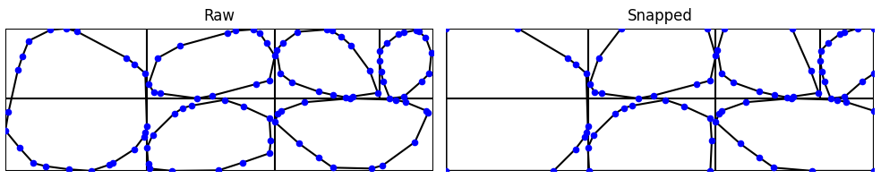

# Sections generator

Under the `sections_generator` we have separate files that help us generate random wall cross sections for our project. We implement several alternative generation methods, all of which export jpg images (used as ground truth in our models), stl files for each stone in the wall (for importing into COMSOL and running physical simulations), and dxf files (used previously for 2D simulations, but now deprecated).

## Files

### `areas.py`
Has all the code for partitioning a rectangle into chunks to resemble a wall section. The main function defined is `divide_cross_section(...)`. You specify wall width and height, the number of rows, a range of how many divisions are possible per row, the minimum fractions of the wall that each row or column must occupy, and whether to include transversal stones (none, random, random or none, center, left, right). Note that if we try to generate center transversal stones and the maximum number of columns is not at least three it will return error. If the minimum number of columns is less than three but the maximum is valid, it will force at least three columns for center TS. This will return `ValueError` if it struggles to find a valid division after a certain number of attempts. 

There is also a `main()` function so the file can be run to display examples of wall subdivisions for the given parameters. Here is a sample result:

### `stones.py`
Defines the core functions for generating and manipulating random polygonal stones inside rectangular wall cells. The primary function is `random_stone(...)`, which generates a random, non-self-intersecting polygon within a bounding box. You specify the bounding box by the variables `width` and `height`; `K` represents the minimum area the stone must cover, `sides` is the number of sides the stone has (before any snapping). After generating the stone, which by default is the size of the bounding box, we make it smaller by a random factor between `min_scale` (0.95 by default) and 1, and then place it randomly within the box.

You can also "snap" stones to edges or corners (`snap_to_border`, `snap_to_corner`), specifying which corner  (`"bottom-left"`, `"bottom-right"`, `"top-left"`, or `"top-right"`) or border (`"bottom"`, `"top"`, `"left"`, `"right"`) as a parameter. Each of these methods have an input `thr` which specifies the threshold such that any point closer than the threshold to a border get snapped. Additionally snapping to corner always forces the closest point to the specified corner, and will also snap that point's immediate neighbors to their corresponding border (as long as they are not already at a border, to avoid conflicts when making many `snap_to_corner` to the same stone). 

### `section.py`
This file defines the `generate_cross_section(...)` function, which takes in all necessary parameters and calls `divide_cross_section` and then generates a stone for each rectangle, snapping to corners and borders as needed. It handles ValueErrors by trying again. It detects where the grid has two cells of the same width as a TS stone, and generates a single stone for the combined area (with 1.5 times more edges). It also occasionally applies a random vertical squeeze to a stone to enhance variability, and at the end cleans up redundant vertices that lie in the same line.

It also has a `main()` function that displays sample sections before and snapping. For example:

### `main3d.py`
This file uses all the above to generate and save a specified number (`target_count`) of sections, according to three possible methods. All result in walls with 0.06m x 0.04m size (unless you modify `MODE_CONFIGS`). The "normal" method just generates the walls as you would expect. The "crop" method generates a longer wall, and creates multiple exports out of it by sliding a window along the wall. We have found this method generates the most realistic and variable results. Finally, the "rotate method" generates a vertical wall with multiple rows and two columns, and then rotates it. This enables rocks to be at the different heights for different columns, but as a tradeoff, all columns are the same width and the random squeezing happens horizontally. You have to specify the generation mode and target count by manually modifying the code inside `main()` and run the file. 